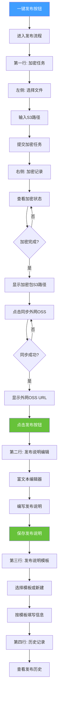

# 一键发布流程设计文档

## 1. 需求概述

### 1.1 核心目标
实现一个简单易用的一键发布流程，让用户能够快速完成从文件加密到对外发布的完整流程。

### 1.2 用户场景
- 用户需要快速发布一个或多个文件
- 用户需要对外网提供加密文件的下载链接
- 用户需要编写发布说明文档

## 2. 整体流程

### 2.1 流程概览

```
┌─────────────────────────────────────────────────────────────────┐
│                        一键发布按钮                              │
└─────────────────────────────────────────────────────────────────┘
                              ↓
┌─────────────────────────────────────────────────────────────────┐
│  第一行: 加密任务                                                 │
│  ┌─────────────────────┐    ┌──────────────────────────────┐   │
│  │ 文件选择            │    │ 加密记录                      │   │
│  │ • S3路径输入        │    │ • 文件列表                    │   │
│  │ • 多文件支持        │    │ • 加密状态                    │   │
│  │ • 提交加密任务      │    │ • 加密包S3路径                │   │
│  └─────────────────────┘    │ • 同步外网OSS按钮             │   │
│                             │ • 外网OSS URL (同步后显示)    │   │
│                             │ • 发布按钮                    │   │
│                             └──────────────────────────────┘   │
└─────────────────────────────────────────────────────────────────┘
                              ↓ (点击发布按钮)
┌─────────────────────────────────────────────────────────────────┐
│  第二行: 发布说明                                                 │
│  ┌──────────────────────────────────────────────────────────┐   │
│  │ 富文本编辑器                                              │   │
│  │ • 编写发布说明内容                                        │   │
│  │ • 支持Markdown格式                                        │   │
│  │ • 确认保存                                                │   │
│  └──────────────────────────────────────────────────────────┘   │
└─────────────────────────────────────────────────────────────────┘
                              ↓
┌─────────────────────────────────────────────────────────────────┐
│  第三行: 发布说明模板                                             │
│  ┌──────────────────────────────────────────────────────────┐   │
│  │ 模板选择                                                  │   │
│  │ • 选择已有模板                                            │   │
│  │ • 新建模板                                                │   │
│  │ • 按照模板填写信息                                        │   │
│  └──────────────────────────────────────────────────────────┘   │
└─────────────────────────────────────────────────────────────────┘
                              ↓
┌─────────────────────────────────────────────────────────────────┐
│  第四行: 历史记录                                                 │
│  ┌──────────────────────────────────────────────────────────┐   │
│  │ 发布历史列表                                                  │   │
│  │ • 发布时间                                                    │   │
│  │ • 发布文件                                                    │   │
│  │ • 发布说明                                                    │   │
│  │ • 外网URL                                                     │   │
│  │ • 发布状态                                                    │   │
│  └──────────────────────────────────────────────────────────┘   │
└─────────────────────────────────────────────────────────────────┘
```

### 2.2 详细流程说明

#### 步骤1: 一键发布入口
- **位置**: 页面最上方
- **功能**: 点击后进入快速发布流程
- **样式**: 大型按钮，醒目突出

#### 步骤2: 加密任务 (第一行)

**左侧 - 文件选择区域**
- **S3路径输入**: 用户输入S3存储路径
- **多文件支持**: 支持选择多个文件
- **提交按钮**: 点击后提交加密任务

**右侧 - 加密记录区域**
- **文件列表**: 显示已提交的加密任务
- **加密状态**: 显示每个文件的加密进度
- **加密包S3路径**: 加密完成后显示加密文件的S3路径
- **同步外网OSS按钮**: 点击后将加密文件同步到外网OSS
- **外网OSS URL**: 同步成功后显示外网访问链接
- **发布按钮**: 点击后进入发布说明编辑页面

#### 步骤3: 发布说明编辑 (第二行)
- **富文本编辑器**: 使用系统现有的Tiptap编辑器
- **编写内容**: 用户编写发布说明
- **保存按钮**: 确认后保存为发布说明

#### 步骤4: 发布说明模板 (第三行)
- **模板选择**: 从已有模板中选择
- **新建模板**: 用户可以创建新模板
- **填写信息**: 按照模板格式填写发布信息

#### 步骤5: 历史记录 (第四行)
- **发布历史**: 显示所有历史发布记录
- **详细信息**: 包括时间、文件、说明、URL、状态等

## 3. 页面布局设计

### 3.1 整体布局结构

```html
<template>
  <div class="quick-publish-page">
    <!-- 一键发布按钮 -->
    <div class="publish-header">
      <el-button type="primary" size="large" @click="startPublish">
        <el-icon><Promotion /></el-icon>
        一键发布
      </el-button>
    </div>

    <!-- 发布流程面板 (点击一键发布后显示) -->
    <div v-if="showPublishFlow" class="publish-flow">
      
      <!-- 第一行: 加密任务 -->
      <el-card class="publish-step">
        <template #header>
          <div class="step-header">
            <span class="step-number">1</span>
            <span class="step-title">加密任务</span>
          </div>
        </template>
        
        <div class="step-content">
          <div class="encrypt-left">
            <h4>选择文件</h4>
            <el-input 
              v-model="s3Path" 
              placeholder="请输入S3路径，如: s3://bucket/path/"
              clearable
            />
            <el-button 
              type="primary" 
              @click="submitEncryptTask"
              :disabled="!s3Path"
            >
              <el-icon><UploadFilled /></el-icon>
              提交加密任务
            </el-button>
          </div>

          <div class="encrypt-right">
            <h4>加密记录</h4>
            <el-table :data="encryptRecords" style="width: 100%">
              <el-table-column prop="fileName" label="文件名" />
              <el-table-column prop="status" label="状态">
                <template #default="{ row }">
                  <el-tag :type="getStatusType(row.status)">
                    {{ row.status }}
                  </el-tag>
                </template>
              </el-table-column>
              <el-table-column prop="s3Path" label="加密包S3路径" show-overflow-tooltip />
              <el-table-column label="操作" width="200">
                <template #default="{ row }">
                  <el-button 
                    size="small" 
                    type="primary"
                    @click="syncToOSS(row)"
                    :disabled="row.status !== '已完成'"
                  >
                    同步外网OSS
                  </el-button>
                  <el-button 
                    v-if="row.ossUrl"
                    size="small" 
                    type="success"
                    @click="publish(row)"
                  >
                    <el-icon><Promotion /></el-icon>
                    发布
                  </el-button>
                </template>
              </el-table-column>
            </el-table>
          </div>
        </div>
      </el-card>

      <!-- 第二行: 发布说明编辑 -->
      <el-card class="publish-step">
        <template #header>
          <div class="step-header">
            <span class="step-number">2</span>
            <span class="step-title">发布说明</span>
          </div>
        </template>
        
        <div class="step-content">
          <div class="release-editor">
            <editor-content :editor="editor" />
            <div class="editor-actions">
              <el-button @click="cancelEdit">取消</el-button>
              <el-button type="primary" @click="saveReleaseNote">保存发布说明</el-button>
            </div>
          </div>
        </div>
      </el-card>

      <!-- 第三行: 发布说明模板 -->
      <el-card class="publish-step">
        <template #header>
          <div class="step-header">
            <span class="step-number">3</span>
            <span class="step-title">发布说明模板</span>
          </div>
        </template>
        
        <div class="step-content">
          <div class="template-section">
            <el-select v-model="selectedTemplate" placeholder="选择模板">
              <el-option 
                v-for="template in templates" 
                :key="template.id"
                :label="template.name"
                :value="template.id"
              />
            </el-select>
            <el-button type="primary" @click="createNewTemplate">新建模板</el-button>
          </div>
        </div>
      </el-card>

      <!-- 第四行: 历史记录 -->
      <el-card class="publish-step">
        <template #header>
          <div class="step-header">
            <span class="step-number">4</span>
            <span class="step-title">历史记录</span>
          </div>
        </template>
        
        <div class="step-content">
          <el-table :data="publishHistory" style="width: 100%">
            <el-table-column prop="publishTime" label="发布时间" width="180" />
            <el-table-column prop="fileName" label="文件名" />
            <el-table-column prop="releaseNote" label="发布说明" show-overflow-tooltip />
            <el-table-column prop="ossUrl" label="外网URL" show-overflow-tooltip />
            <el-table-column prop="status" label="状态" width="100">
              <template #default="{ row }">
                <el-tag :type="getStatusType(row.status)">
                  {{ row.status }}
                </el-tag>
              </template>
            </el-table-column>
          </el-table>
        </div>
      </el-card>
    </div>
  </div>
</template>
```

### 3.2 CSS样式

```css
<style scoped>
.quick-publish-page {
  padding: 20px;
}

/* 一键发布按钮 */
.publish-header {
  text-align: center;
  margin-bottom: 30px;
}

.publish-header .el-button {
  font-size: 18px;
  padding: 15px 40px;
  box-shadow: 0 4px 12px rgba(64, 158, 255, 0.3);
}

/* 发布流程 */
.publish-flow {
  display: flex;
  flex-direction: column;
  gap: 20px;
}

/* 步骤卡片 */
.publish-step {
  box-shadow: 0 2px 8px rgba(0, 0, 0, 0.1);
}

.step-header {
  display: flex;
  align-items: center;
  gap: 10px;
}

.step-number {
  display: inline-flex;
  align-items: center;
  justify-content: center;
  width: 30px;
  height: 30px;
  background: #409eff;
  color: white;
  border-radius: 50%;
  font-weight: bold;
}

.step-title {
  font-size: 16px;
  font-weight: 600;
  color: #303133;
}

/* 第一行: 加密任务布局 */
.step-content {
  display: flex;
  gap: 20px;
}

.encrypt-left, .encrypt-right {
  flex: 1;
}

.encrypt-left h4, .encrypt-right h4 {
  margin: 0 0 15px 0;
  font-size: 14px;
  color: #606266;
  font-weight: 500;
}

/* 第二行: 发布说明编辑器 */
.release-editor {
  border: 1px solid #ebeef5;
  border-radius: 4px;
  padding: 15px;
  min-height: 300px;
}

.editor-actions {
  display: flex;
  justify-content: flex-end;
  gap: 10px;
  margin-top: 15px;
  padding-top: 15px;
  border-top: 1px solid #ebeef5;
}

/* 第三行: 模板选择 */
.template-section {
  display: flex;
  gap: 10px;
  align-items: center;
}

/* 响应式布局 */
@media (max-width: 768px) {
  .step-content {
    flex-direction: column;
  }
  
  .encrypt-left, .encrypt-right {
    width: 100%;
  }
}
</style>
```

## 4. 流程图

### 4.1 Mermaid 流程图



### 4.2 简化流程图

```
┌─────────────┐
│ 一键发布按钮 │
└──────┬──────┘
       ↓
┌──────────────────────────────────────┐
│  第一行: 加密任务                      │
│  ┌──────────┐    ┌─────────────────┐ │
│  │ 选择文件  │ →  │   加密记录       │ │
│  │          │    │ • 加密状态       │ │
│  │ S3路径   │    │ • 加密包路径     │ │
│  │ 提交任务  │    │ • 同步OSS按钮   │ │
│  └──────────┘    │ • 外网URL        │ │
│                  │ • [发布]按钮     │ │
│                  └────────┬────────┘ │
└───────────────────────────┼──────────┘
                            ↓
┌──────────────────────────────────────┐
│  第二行: 发布说明编辑                  │
│  ┌────────────────────────────────┐  │
│  │  富文本编辑器                   │  │
│  │  • 编写内容                     │  │
│  │  • 保存发布说明                 │  │
│  └────────────────────────────────┘  │
└──────────────────────────────────────┘
                            ↓
┌──────────────────────────────────────┐
│  第三行: 发布说明模板                  │
│  ┌────────────────────────────────┐  │
│  │  • 选择模板                      │  │
│  │  • 新建模板                      │  │
│  │  • 填写信息                      │  │
│  └────────────────────────────────┘  │
└──────────────────────────────────────┘
                            ↓
┌──────────────────────────────────────┐
│  第四行: 历史记录                      │
│  ┌────────────────────────────────┐  │
│  │  • 发布时间                      │  │
│  │  • 发布文件                      │  │
│  │  • 发布说明                      │  │
│  │  • 外网URL                       │  │
│  │  • 发布状态                      │  │
│  └────────────────────────────────┘  │
└──────────────────────────────────────┘
```

## 5. 数据结构设计

### 5.1 加密任务数据结构

```typescript
interface EncryptTask {
  id: string;           // 任务ID
  fileName: string;     // 文件名
  s3Path: string;       // S3路径
  status: 'pending' | 'processing' | 'completed' | 'failed';  // 状态
  encryptS3Path?: string;  // 加密包S3路径
  ossUrl?: string;      // 外网OSS URL
  createdAt: number;    // 创建时间
  updatedAt: number;    // 更新时间
}
```

### 5.2 发布说明数据结构

```typescript
interface ReleaseNote {
  id: string;           // 说明ID
  title: string;        // 标题
  content: string;      // 内容(Markdown)
  templateId?: string;  // 模板ID
  fileId: string;       // 关联的文件ID
  ossUrl: string;       // 外网URL
  status: 'draft' | 'published';  // 状态
  createdAt: number;
  updatedAt: number;
}
```

### 5.3 模板数据结构

```typescript
interface Template {
  id: string;
  name: string;         // 模板名称
  content: string;      // 模板内容
  fields: TemplateField[];  // 模板字段
  createdAt: number;
}

interface TemplateField {
  name: string;         // 字段名称
  type: 'text' | 'textarea' | 'select';  // 字段类型
  required: boolean;    // 是否必填
  defaultValue?: string;  // 默认值
}
```

## 6. API接口设计

### 6.1 加密任务相关

```typescript
// 提交加密任务
POST /api/v1/encrypt/tasks
{
  "s3Paths": ["s3://bucket/file1.zip", "s3://bucket/file2.zip"]
}

// 查询加密任务列表
GET /api/v1/encrypt/tasks?page=1&pageSize=10

// 同步到外网OSS
POST /api/v1/encrypt/tasks/:taskId/sync-oss
```

### 6.2 发布说明相关

```typescript
// 保存发布说明
POST /api/v1/release-notes
{
  "fileId": "task-123",
  "title": "v1.0.0 版本发布",
  "content": "# 版本说明...",
  "ossUrl": "https://cdn.example.com/file.zip"
}

// 查询发布历史
GET /api/v1/release-notes?page=1&pageSize=10
```

### 6.3 模板相关

```typescript
// 获取模板列表
GET /api/v1/templates

// 创建新模板
POST /api/v1/templates
{
  "name": "标准发布模板",
  "content": "# {{version}}\n\n## 变更内容...",
  "fields": [
    { "name": "version", "type": "text", "required": true }
  ]
}
```

## 7. 交互细节

### 7.1 一键发布按钮
- **初始状态**: 显示在页面最上方
- **点击后**: 展开完整的发布流程面板
- **再次点击**: 可以收起流程面板

### 7.2 加密任务流程
1. 用户输入S3路径
2. 点击"提交加密任务"
3. 系统开始加密，显示进度
4. 加密完成后显示加密包S3路径
5. 用户点击"同步外网OSS"
6. 同步成功后显示外网URL
7. 用户点击"发布"按钮

### 7.3 发布说明编辑
1. 点击"发布"按钮后自动跳转到发布说明编辑区域
2. 使用富文本编辑器编写内容
3. 支持Markdown格式
4. 点击"保存发布说明"完成

### 7.4 模板选择
1. 用户可以选择已有模板
2. 也可以点击"新建模板"创建新模板
3. 按照模板格式填写信息

### 7.5 历史记录
- 自动显示所有发布历史
- 支持按时间、状态等筛选
- 点击可查看详情

## 8. 技术实现要点

### 8.1 使用的组件
- **富文本编辑器**: Tiptap (系统已有)
- **表格**: Element Plus Table
- **按钮**: Element Plus Button
- **输入框**: Element Plus Input
- **下拉选择**: Element Plus Select

### 8.2 状态管理
- 使用Pinia管理发布流程状态
- 加密任务状态实时更新
- 发布说明草稿自动保存

### 8.3 响应式设计
- 支持桌面端和移动端
- 小屏幕自动调整为垂直布局
- 表格在小屏幕显示关键信息

## 9. 注意事项

1. **加密安全性**: 确保加密算法的安全性
2. **OSS同步**: 同步过程需要进度提示
3. **错误处理**: 网络错误、加密失败等情况需要友好提示
4. **性能优化**: 大文件加密需要后台异步处理
5. **权限控制**: 确保只有授权用户可以发布

## 10. 后续优化建议

1. **批量发布**: 支持多个文件批量发布
2. **定时发布**: 支持设置发布时间
3. **版本管理**: 支持版本号自动生成
4. **通知功能**: 发布成功后通知相关人员
5. **统计分析**: 发布数据统计和分析

---

**文档版本**: 1.0  
**创建日期**: 2026-02-22  
**最后更新**: 2026-02-22
